# AlgoVerse - NFT Marketplace Launchpad Platform

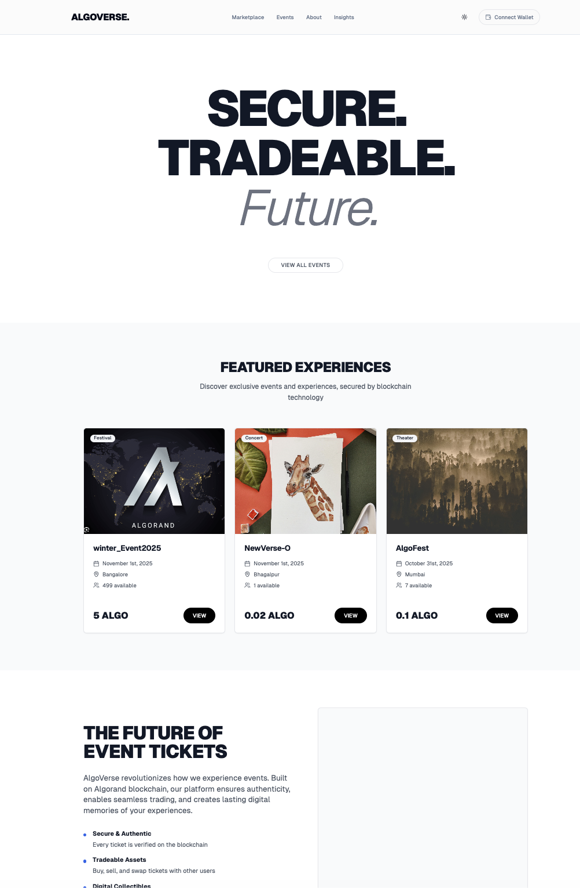

> **Create, launch, and scale your NFT marketplace on Algorand in minutes. No coding required.**

> Built for creators, brands, and businesses ready to enter Web3.

A comprehensive, decentralized NFT marketplace platform for event tickets, digital collectibles, and experiences, built on the Algorand blockchain. AlgoVerse provides white-label marketplace solutions that enable anyone to launch their own branded NFT marketplace without writing a single line of code. With our template-based system, atomic swaps, Dutch mint bulk pricing, launchpad functionality, and complete ecosystem, you can go from idea to live marketplace in minutes.

## 🚀 Why AlgoVerse?

### **No-Code Marketplace Creation**
Launch your NFT marketplace in minutes, not months. Our template-based system eliminates the need for coding knowledge, allowing creators, brands, and businesses to focus on what matters: building their Web3 presence and engaging with their community.

### **Built for Everyone**
- **Creators**: Monetize your art, music, or digital content instantly
- **Brands**: Enter Web3 with a fully branded marketplace tailored to your identity
- **Businesses**: Launch NFT campaigns, loyalty programs, or event ticketing with enterprise-grade infrastructure
- **Event Organizers**: Sell tickets, manage inventory, and verify entry—all on the blockchain

### **Enterprise-Grade Infrastructure**
- Algorand blockchain ensures fast, secure, and eco-friendly transactions
- White-label solution means your brand, your marketplace
- Built-in analytics, royalty management, and payment processing
- Scalable architecture that grows with your business

## 🌟 Core Features

### 1. **Blockchain-Powered NFT System**
- **Algorand Standard Assets (ASAs)**: All NFTs are created as ASAs on Algorand blockchain
- **Instant Minting**: Fast NFT creation and minting with minimal fees (fractions of a cent)
- **Metadata Management**: Rich NFT metadata stored on IPFS for decentralized storage
- **Dynamic NFTs**: Update metadata post-mint for evolving ticket information
- **Royalty Support**: Automatic royalty distribution on secondary sales

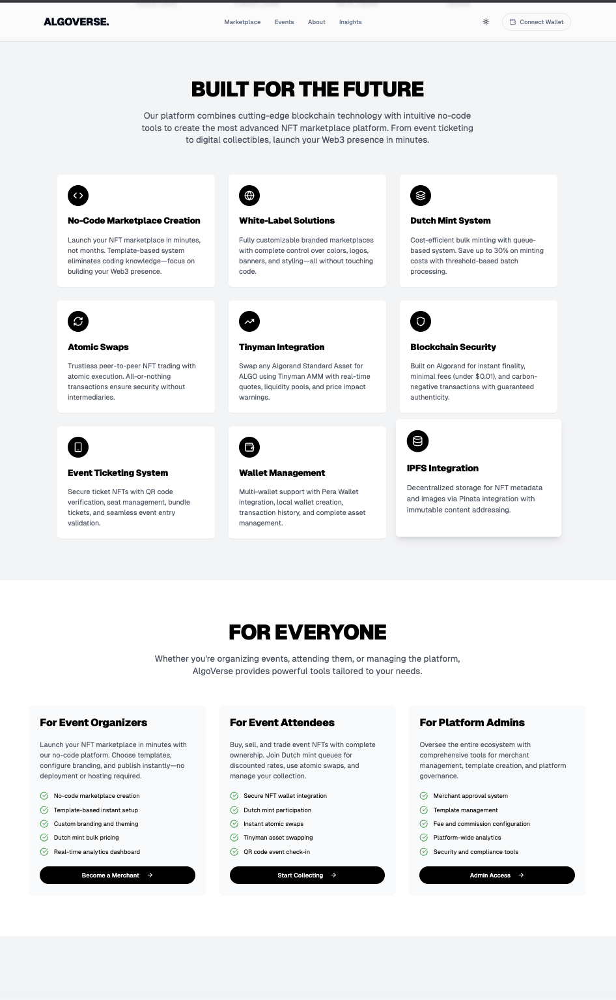

### 2. **Event Ticketing System**
- **Secure Ticket NFTs**: Each event ticket is a unique, verifiable NFT on the blockchain
- **QR Code Verification**: Generate and scan QR codes for event entry verification
- **Seat Management**: Assign and update seat numbers, sections, and ticket types
- **Bundle Tickets**: Create bundled ticket packages with multiple NFTs
- **Ticket Transfer**: Easy transfer of tickets between users
- **Purchase Flow**: Complete purchase-to-mint workflow with payment verification

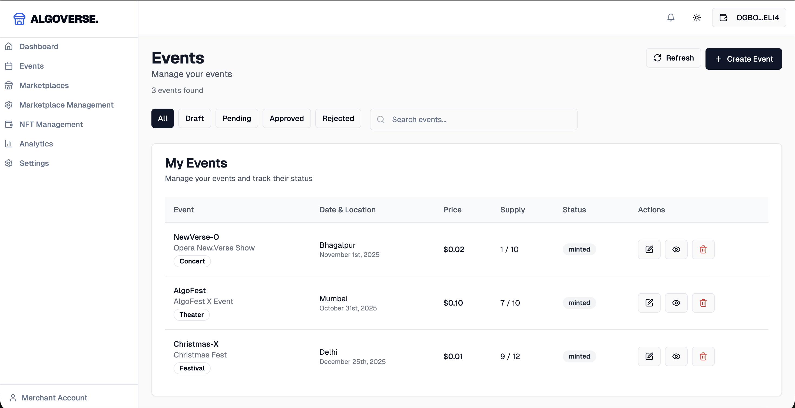

### 3. **White-Label Marketplace Platform** ⚡ *No-Code Required*
- **Template-Based System**: Choose from pre-built marketplace templates—no coding needed
- **Instant Setup**: Create and launch your marketplace in minutes using our intuitive wizard
- **Custom Branding**: Fully customize colors, logos, banners, and styling without touching code
- **Dynamic Theming**: Theme engine automatically applies your branding across all pages
- **Collection Management**: Create and manage NFT collections through an easy-to-use interface
- **Product Listings**: List and sell NFTs as products with pricing and inventory management
- **Multi-Merchant Support**: Launch multiple branded marketplaces from a single account

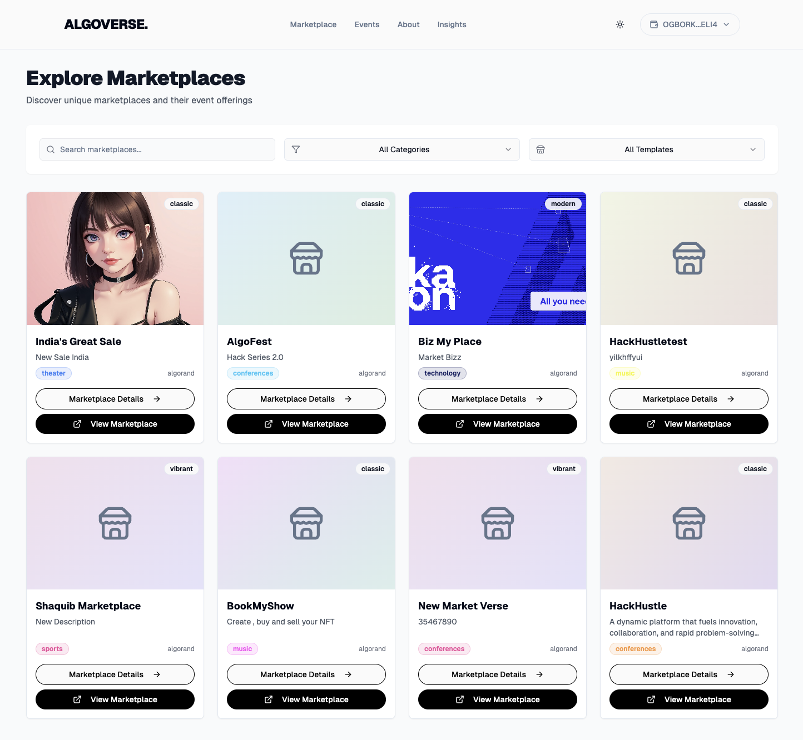

### 4. **Atomic Swaps**
- **Peer-to-Peer Trading**: Trustless NFT swaps between users without intermediaries
- **Atomic Execution**: All-or-nothing transaction execution ensures security
- **Expiry Support**: Time-limited swap offers with automatic cancellation
- **On-Chain Security**: All swaps recorded immutably on blockchain
- **Swap History**: Track all swap transactions and status

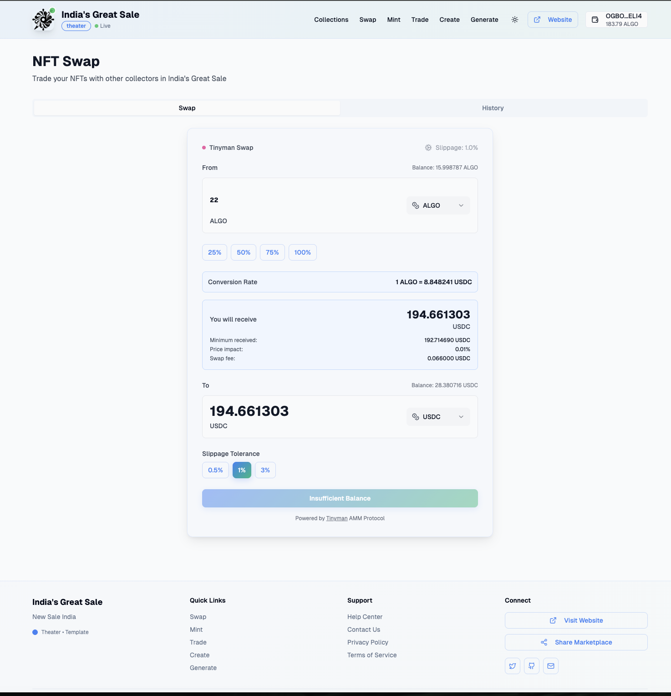

### 5. **Tinyman Integration**
- **Asset Swapping**: Swap any Algorand Standard Asset (ASA) for ALGO using Tinyman AMM
- **Liquidity Pools**: Automatic discovery and interaction with Tinyman liquidity pools
- **Real-Time Quotes**: Live price quotes with slippage tolerance
- **Price Impact Warnings**: Alerts for high price impact trades
- **Transaction Status**: Complete transaction flow tracking

### 6. **Wallet Management**
- **Multi-Wallet Support**: Connect Pera Wallet or create/import local wallets
- **Pera Wallet Integration**: Seamless connection to Pera Wallet mobile app
- **Local Wallet Creation**: Generate new wallets with mnemonic phrase backup
- **Wallet Import**: Import existing wallets using mnemonic phrases
- **Transaction History**: Complete transaction log with filtering
- **Balance Tracking**: Real-time balance updates for ALGO and ASAs
- **Asset Management**: View and manage all assets in wallet
- **Send/Receive**: Send ALGO and ASAs to other addresses

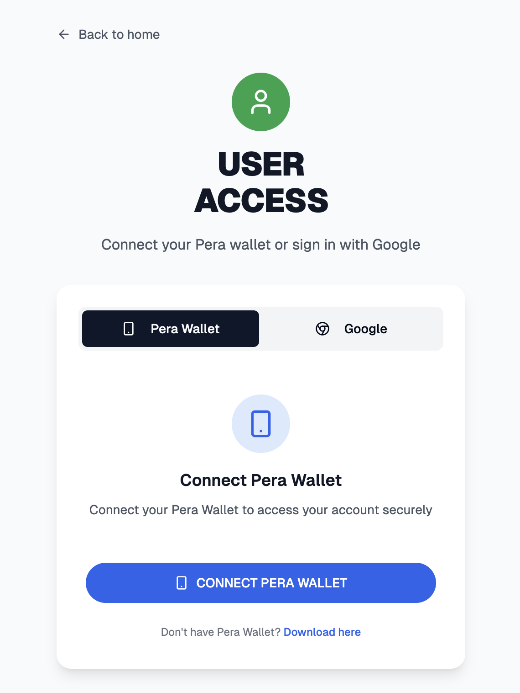

### 7. **IPFS Integration**
- **Decentralized Storage**: Store NFT metadata and images on IPFS
- **Pinata Integration**: Reliable pinning service for IPFS content
- **Metadata Upload**: Upload and manage NFT metadata JSON files
- **Image Storage**: Store NFT images with IPFS hash references
- **Content Addressing**: Immutable content addressing via IPFS hashes

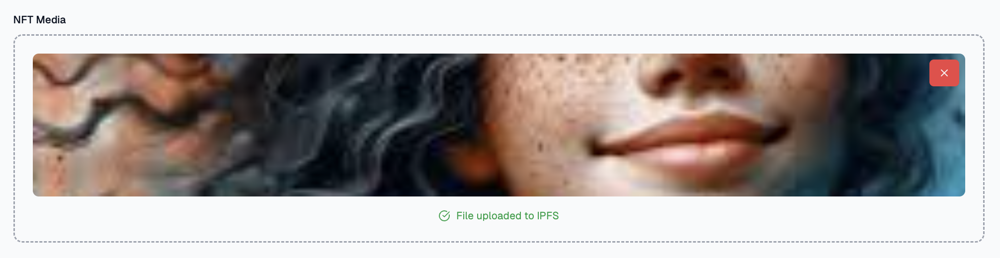

### 8. **Collections & Products**
- **Collection Creation**: Merchants can create NFT collections for their marketplaces
- **Product Management**: List NFTs as products with pricing, inventory, and details
- **Supply Management**: Track current and available supply of NFTs
- **Minting Sessions**: Create scheduled minting sessions for products
- **Collection Filtering**: Filter and search collections by various attributes

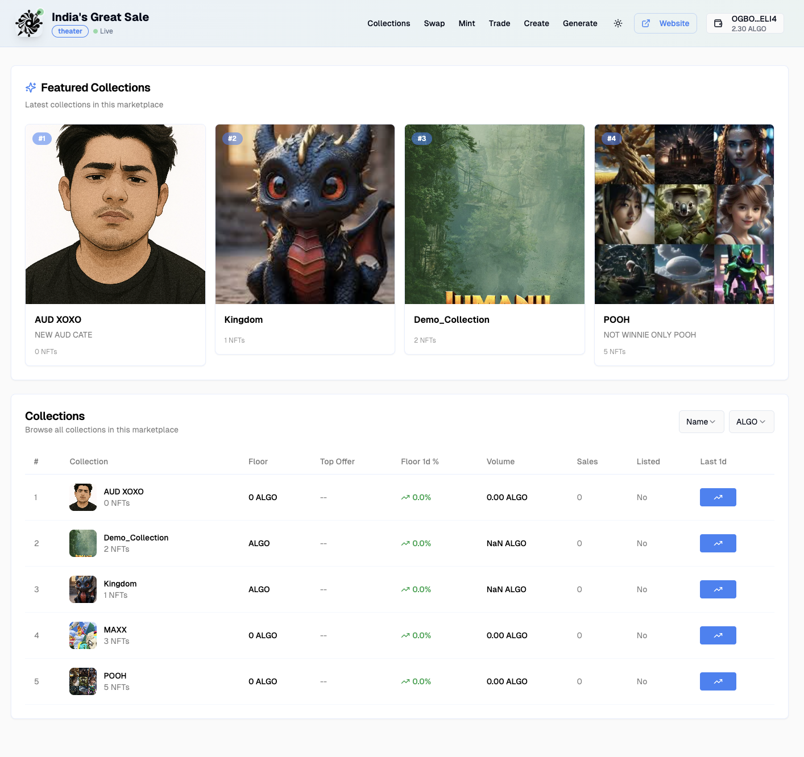

### 9. **Dutch Mint System** 🎯 *Cost-Efficient Bulk Minting*
- **Queue-Based Minting**: Join a minting queue and lock funds in escrow until threshold is met
- **Threshold-Based Trigger**: Automatic batch minting when minimum threshold of NFTs is reached
- **Discounted Rates**: Save up to 30% on minting costs with bulk pricing (e.g., 0.007 ALGO vs 0.01 ALGO per NFT)
- **Smart Contract Escrow**: Funds securely locked in smart contract escrow until minting triggers
- **Time-Limited Windows**: Configurable time windows for threshold achievement
- **Automatic Refunds**: Full refunds if threshold isn't met within the time window
- **Real-Time Queue Status**: Monitor queue progress, current count, and time remaining
- **Batch Processing**: Efficient gas usage through batch transaction processing

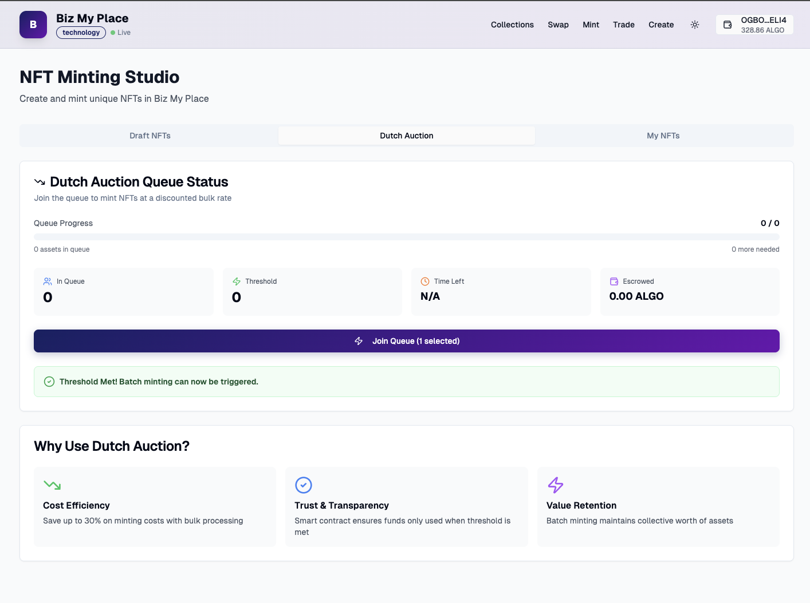

### 10. **Trading & Secondary Market**
- **Buy/Sell NFTs**: List NFTs for sale and purchase from other users
- **Auction System**: Place NFTs in auctions with bidding functionality
- **Order Management**: Manage buy and sell orders
- **Trading History**: Complete trading history across all marketplaces
- **Price Tracking**: Track NFT prices and market statistics

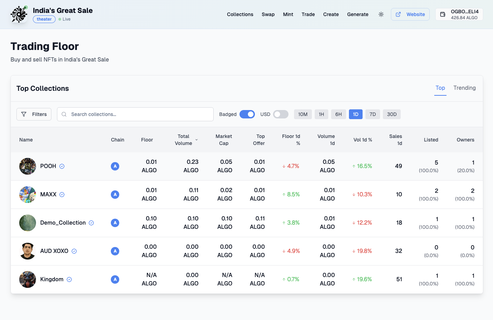

### 11. **Analytics & Reporting**
- **Platform Analytics**: Platform-wide statistics and metrics
- **Merchant Analytics**: Detailed analytics for merchant marketplaces
- **Marketplace Analytics**: Individual marketplace performance metrics
- **User Activity**: Track user activity and engagement
- **Revenue Tracking**: Monitor revenue, fees, and commissions
- **NFT Statistics**: NFT ownership, trading, and market data

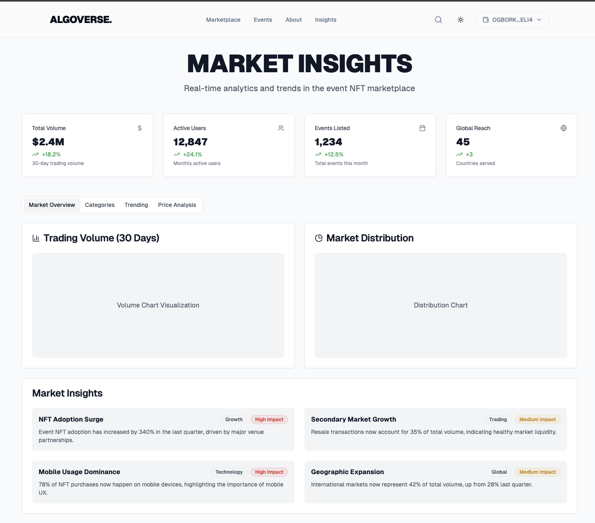

### 12. **Role-Based Access Control**
- **Three User Roles**: Admin, Merchant, and User with distinct permissions
- **Admin Dashboard**: Platform management, merchant approval, template management
- **Merchant Dashboard**: Marketplace creation, event management, analytics
- **User Dashboard**: NFT collection, wallet, activity tracking
- **JWT Authentication**: Secure token-based authentication
- **Session Management**: Persistent sessions with cookie-based storage

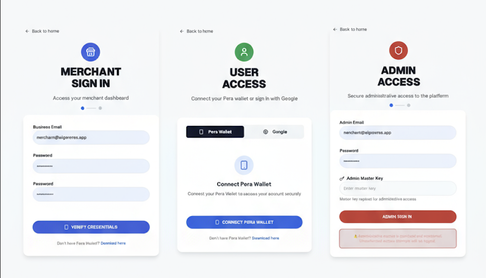

### 13. **Security Features**
- **Blockchain Verification**: All transactions verified on-chain
- **Immutable Records**: Permanent transaction history on blockchain
- **Private Key Security**: Secure handling of wallet private keys
- **Password Hashing**: bcrypt password hashing for user accounts
- **Role-Based Authorization**: Middleware-based route protection
- **Transaction Signing**: Secure transaction signing process

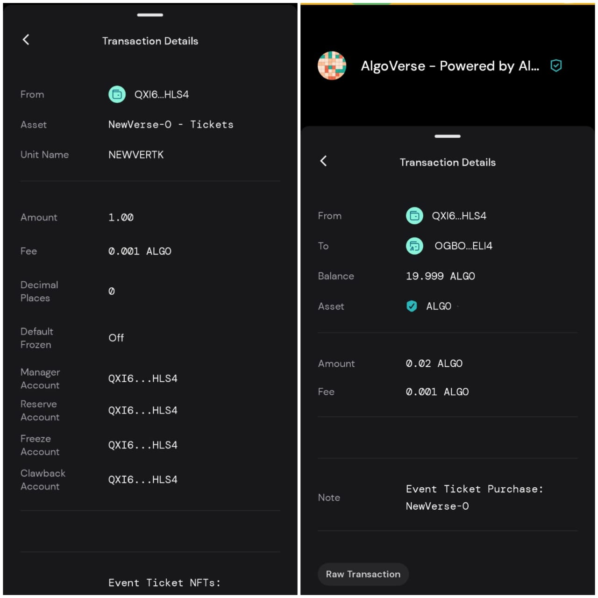

## 🏗️ Architecture

### Frontend Stack
- **Next.js 14**: React framework with App Router
- **TypeScript**: Full type safety across the application
- **Tailwind CSS**: Utility-first CSS framework with custom theme system
- **Framer Motion**: Smooth animations and transitions
- **shadcn/ui**: High-quality, accessible UI components
- **React Hook Form**: Form management with validation
- **Zod**: Schema validation

### Backend Stack
- **Firebase Firestore**: NoSQL database for application data
- **Firebase Admin SDK**: Server-side Firebase operations
- **Algorand SDK (algosdk)**: Blockchain interaction and transaction management
- **IPFS/Pinata**: Decentralized storage for NFT metadata
- **JWT (jose)**: Token-based authentication
- **bcryptjs**: Password hashing

### Blockchain Integration
- **Algorand Network**: Supports both Testnet and Mainnet
- **Algorand Indexer**: Querying blockchain data and transaction history
- **Algod Client**: Submitting transactions and querying network status
- **ASA Operations**: Creating, minting, and transferring NFTs
- **Atomic Transfers**: Grouped transactions for swaps and complex operations

### Key Libraries
- **@tinymanorg/tinyman-js-sdk**: Tinyman AMM protocol integration
- **@txnlab/use-wallet-react**: React hooks for Algorand wallet management
- **@perawallet/connect**: Pera Wallet browser integration
- **algosdk**: Official Algorand JavaScript SDK

## 📱 User Roles & Use Cases

### For Event Organizers (Merchants)

#### Marketplace Creation 🚀 *Launch in Minutes*
1. **Register as Merchant**: Submit merchant application with business details
2. **Create Marketplace**: Choose template, configure branding, set up payment methods—all through our no-code interface
3. **Customize Theme**: Apply custom colors, logos, banners, and styling with visual controls
4. **Configure Settings**: Set up collections, enable features (minting, trading, swaps) with simple toggles
5. **Publish Marketplace**: Launch your white-label marketplace instantly—no deployment or hosting required

#### Event Management
1. **Create Events**: Set up events with details, dates, locations, pricing
2. **Create Collections**: Organize NFTs into collections (e.g., "VIP Tickets", "General Admission")
3. **Mint Tickets**: Mint NFT tickets for events with metadata (seat, section, type)
4. **Manage Inventory**: Track available supply, sold tickets, revenue
5. **View Analytics**: Monitor sales, revenue, and user engagement

#### NFT Operations
1. **Bulk Minting**: Mint multiple NFTs in batch operations
2. **Metadata Updates**: Update ticket metadata post-mint (seat changes, date updates)
3. **Price Management**: Set and update NFT prices
4. **Royalty Configuration**: Configure royalty percentages for secondary sales

#### Dutch Mint Configuration
1. **Deploy Smart Contract**: Deploy Dutch mint contract with threshold, pricing, and time window settings
2. **Configure Pricing**: Set base cost and effective cost (discounted bulk rate) for minting
3. **Set Threshold**: Define minimum number of NFTs required to trigger batch minting
4. **Monitor Queue**: Track queue progress and escrowed funds in real-time
5. **Trigger Minting**: Automatically trigger batch minting when threshold is met
6. **Handle Refunds**: Process refunds if threshold isn't met within time window

### For Event Attendees (Users)

#### Ticket Purchase
1. **Browse Events**: Discover events on marketplace homepage
2. **Select Tickets**: Choose event, ticket type, quantity
3. **Connect Wallet**: Connect Pera Wallet or use local wallet
4. **Complete Purchase**: Sign payment transaction, receive NFT tickets
5. **Claim Tickets**: Claim minted tickets to wallet

#### Dutch Mint Participation
1. **Join Queue**: Select NFTs and join the Dutch mint queue
2. **Lock Payment**: Funds automatically locked in smart contract escrow at discounted rate
3. **Monitor Progress**: Track queue count and time remaining until threshold
4. **Receive NFTs**: Automatically receive NFTs when threshold is met and batch minting triggers
5. **Request Refund**: Get full refund if threshold isn't met within time window

#### Ticket Management
1. **View Collection**: See all owned NFT tickets in wallet
2. **Transfer Tickets**: Send tickets to other wallet addresses
3. **QR Verification**: Generate QR codes for event entry
4. **Check-in**: Use QR codes at event venues for entry

#### Trading & Swaps
1. **Atomic Swaps**: Trade NFTs directly with other users
2. **List for Sale**: List NFTs on secondary market
3. **Buy NFTs**: Purchase NFTs from other users
4. **Swap Assets**: Use Tinyman to swap any ASA for ALGO
5. **View History**: Track all trades, swaps, and transactions

#### Wallet Operations
1. **Wallet Management**: Create, import, or connect wallets
2. **Send/Receive**: Transfer ALGO and ASAs
3. **View Balance**: Check ALGO and asset balances
4. **Transaction History**: Review all wallet transactions

### For Platform Admins

#### Platform Management
1. **Merchant Approval**: Review and approve/reject merchant applications
2. **Template Management**: Create and manage marketplace templates
3. **Fee Configuration**: Set platform fees and commission rates
4. **Settings Management**: Configure platform-wide settings
5. **Analytics**: View platform-wide statistics and metrics

#### Monitoring & Oversight
1. **Marketplace Oversight**: Monitor all merchant marketplaces
2. **Event Management**: Review and manage platform events
3. **User Management**: View and manage user accounts
4. **Security Tools**: Monitor security events and transactions
5. **Compliance**: Ensure compliance with regulations

## 🔧 How It Works

### NFT Creation & Minting Flow

1. **Collection Creation**: Merchant creates a collection for an event or product
2. **NFT Configuration**: Define NFT metadata, supply, pricing, and attributes
3. **ASA Creation**: System creates Algorand Standard Asset with metadata
4. **IPFS Upload**: NFT image and metadata JSON uploaded to IPFS
5. **Asset Creation Transaction**: Transaction submitted to Algorand network
6. **Confirmation**: Wait for transaction confirmation (typically < 5 seconds)
7. **Storage**: NFT data stored in Firestore with asset ID and IPFS hash

### Purchase & Minting Flow

1. **User Selects NFT**: User browses marketplace and selects NFT to purchase
2. **Payment Transaction**: System creates payment transaction from user to merchant
3. **Wallet Signing**: User signs transaction in connected wallet
4. **Transaction Submission**: Signed transaction submitted to Algorand
5. **Confirmation**: Wait for payment confirmation
6. **Minting**: System mints NFT to user's wallet address
7. **Opt-in Check**: System ensures user has opted into asset (auto-opt-in if needed)
8. **NFT Transfer**: NFT transferred to user's wallet
9. **Record Update**: Purchase and mint records updated in Firestore

### Atomic Swap Flow

1. **Swap Creation**: User A creates swap proposal (NFT X for NFT Y)
2. **Proposal Submission**: Swap proposal stored in Firestore with expiry
3. **User B Notification**: User B sees swap proposal in swap interface
4. **Acceptance**: User B accepts swap proposal
5. **Transaction Group**: System creates atomic transfer group:
   - User A sends NFT X to User B
   - User B sends NFT Y to User A
6. **Dual Signing**: Both users sign their respective transactions
7. **Atomic Execution**: All transactions execute together or all fail
8. **Confirmation**: Swap completion recorded on blockchain and in Firestore

### Tinyman Swap Flow

1. **Asset Selection**: User selects asset to swap and amount
2. **Quote Request**: System requests quote from Tinyman AMM
3. **Quote Display**: Shows receive amount, price impact, fees, minimum received
4. **Slippage Configuration**: User sets slippage tolerance (0.5%, 1%, 3%)
5. **Transaction Preparation**: Tinyman SDK prepares swap transaction group
6. **Wallet Signing**: User signs transactions in wallet
7. **Swap Execution**: Transactions submitted to Tinyman and Algorand
8. **Confirmation**: Wait for blockchain confirmation
9. **Balance Update**: User's balance refreshed with new amounts

### Dutch Mint Flow

1. **Contract Deployment**: Merchant deploys Dutch mint smart contract with threshold, pricing, and time window configuration
2. **User Joins Queue**: User selects NFTs and joins minting queue by locking payment in escrow
3. **Queue Building**: System tracks queue count and escrowed funds as more users join
4. **Threshold Monitoring**: Smart contract monitors if queue_count >= threshold
5. **Automatic Trigger**: When threshold is met, anyone can trigger batch minting
6. **Batch Minting**: Platform executes batch minting for all queued assets efficiently
7. **Payment Release**: Escrow releases payment to platform at discounted bulk rate
8. **NFT Distribution**: All queued users receive their NFTs in their wallets
9. **Refund Option**: If time window expires without threshold, users can request full refunds

### Marketplace Rendering Flow

1. **Template Loading**: System loads marketplace template configuration
2. **Marketplace Data**: Fetch marketplace data from Firestore
3. **Collection Data**: Load collections and products for marketplace
4. **Theme Application**: Apply merchant branding (colors, logos, styling)
5. **Component Rendering**: Template engine renders components using template rules
6. **Dynamic Routing**: Generate routes for collections, products, swap, mint pages
7. **Client-Side Hydration**: React components hydrate with data

## 📄 License

This project is licensed under the MIT License - see the [LICENSE](LICENSE) file for details.
